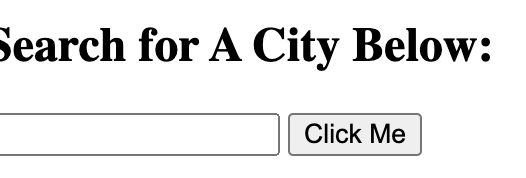
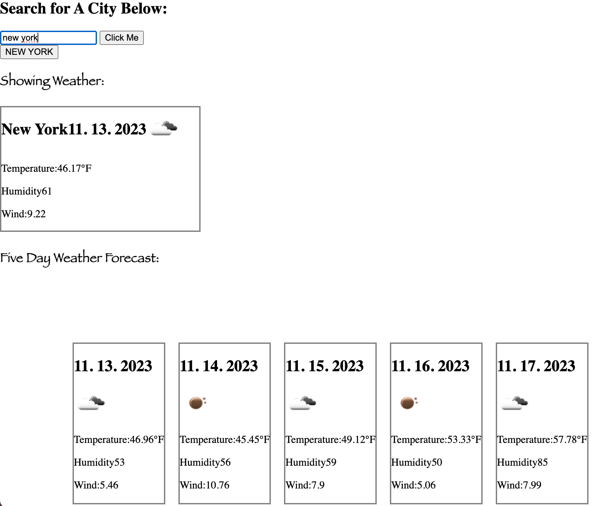
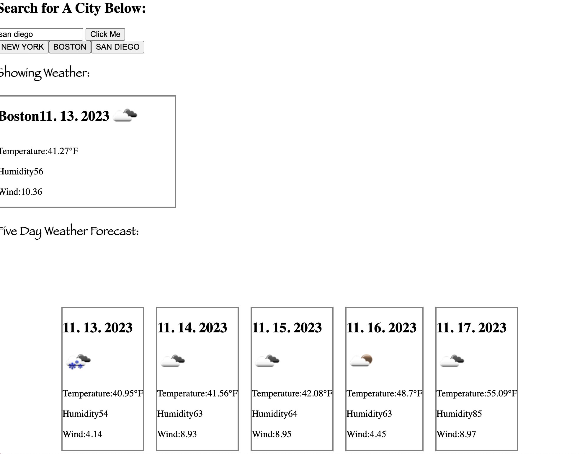
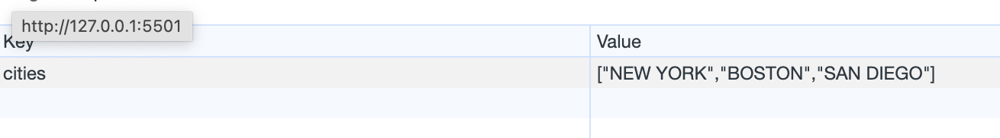

# Weather-Dashboard-Hw-

## Description

The motivation behind the project was to create a weather application for users to see current and future weather conditions for any city that they input. We built this project to make it easier for users to see what the weather is like based on the city so that they can plan accordingly/have a better idea of what the weather will be like. When they view the city, they can see the date and data about that city's weather such as the temperature, humidity, windSpeed, etc for both the current day and a five day forecast. Additionally, they should be able to see the weather conditions for any city they input in their search history by clicking on the button of any city they previously input. It solves the problem of creating a space to see specific weather data for users in a clear and easy to manage way. I learned a lot about using the fetch method to retrieve data from an API, using local storage to store relevant data, extracting specific components from the API, manipulating strings, objects, and arrays using JSONparse and stringify, and practicing different functions in js to get everything to come together.  

## Usage
Link to live site: https://rosiedeng1.github.io/Weather-Dashboard-Hw-/

Instructions for ![SearchBarforCity]: You can type in the name of a city that you want to get the current weather and forecast for. Click on the "click me" button to show the correpsonding weather for city 
Instructions for ![CitySearch]: You can see the current weather conditions for that city, in this case is New York, which includes the date, temperature, humidity, and wind for that city. A 5 day forecast for that city's weather with similar details will appear 
Instructions for ![SearchHistory]: A list of the cities you've searched for will appear in the search history. When you click on a city you've search for in the past on the button, for example in this case Boston, you will see the weather conditions and the 5 day forecast for that city appear. 
Instructions for ![LocalStorage]: When you inspect the application in the browser, you will see the list of cities you've searched for saved in the local storage 

## Credits

How to use fetch API: https://developer.mozilla.org/en-US/docs/Web/API/Fetch_API/Using_Fetch
JSON stringify: https://developer.mozilla.org/en-US/docs/Web/JavaScript/Reference/Global_Objects/JSON/stringify
Create element method: https://developer.mozilla.org/en-US/docs/Web/API/Document/createElement
Array includes method: https://www.w3schools.com/JSREF/jsref_includes_array.asp
## License

Please refer to the LICENSE in the repo.